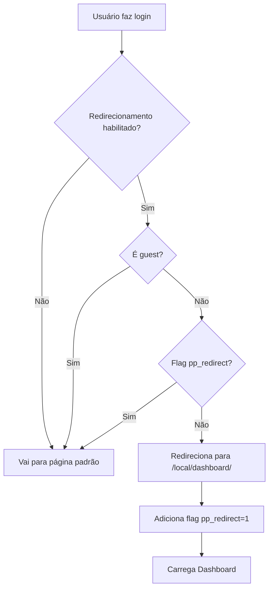
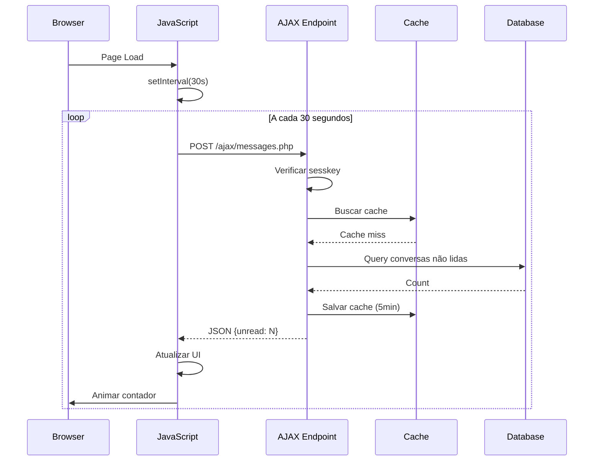
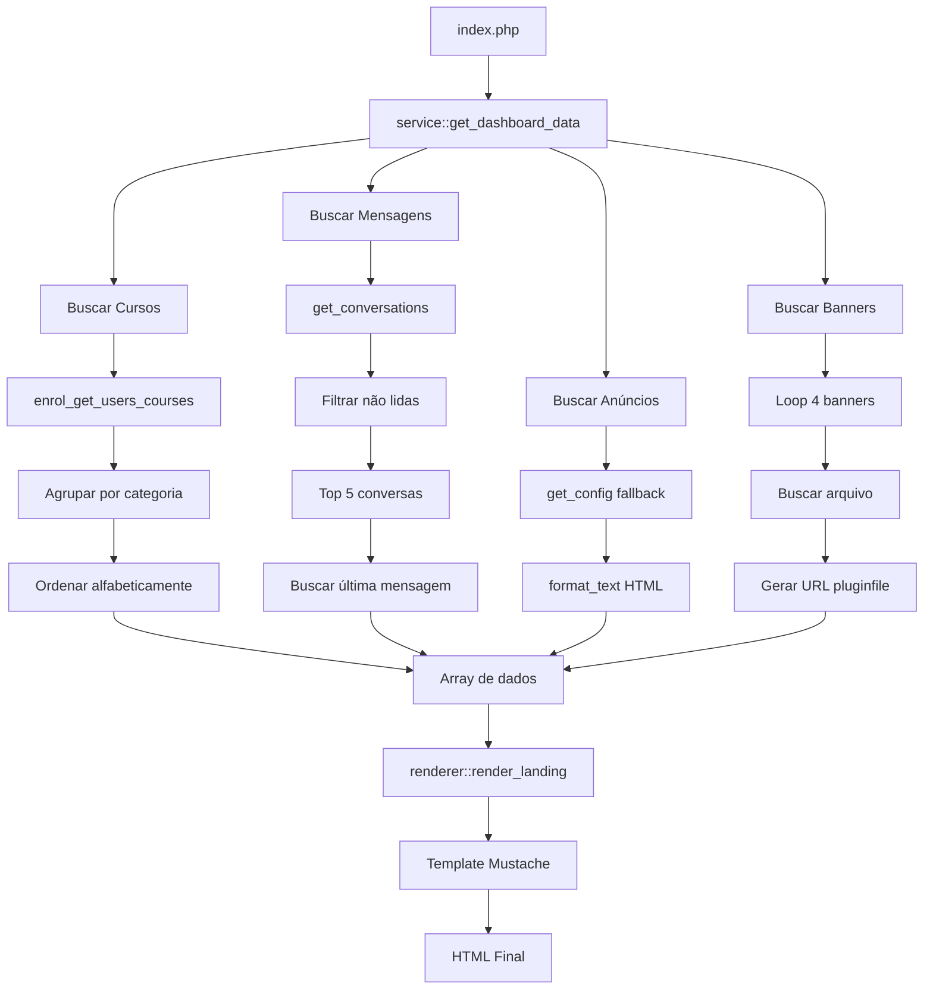

# Especificação Técnica - local_dashboard (Portal Acadêmico)

**Versão:** 2025101401  
**Data da Análise:** 8 de janeiro de 2026  
**Autor:** Análise de Código Automatizada  
**Compatibilidade:** Moodle 4.0+  
**Tipo:** Plugin Local (Local Plugin)

---

## 1. Visão Geral

### 1.1 Descrição do Plugin
**local_dashboard** é um plugin local para Moodle que cria um portal acadêmico centralizado, agregando informações importantes do estudante em uma única página. Funciona como um dashboard personalizado após o login, oferecendo visão 360° das atividades acadêmicas.

### 1.2 Problema que Resolve
- Fragmentação de informações em múltiplas páginas do Moodle
- Baixo engajamento inicial de estudantes com a plataforma
- Dificuldade em visualizar disciplinas, prazos e mensagens de forma unificada
- Necessidade de navegar por várias áreas para obter informações básicas
- Falta de visibilidade de comunicados importantes

### 1.3 Principais Características
- ✅ Dashboard unificado com 3 cards principais
- ✅ Redirecionamento automático após login (configurável)
- ✅ Sistema de mensagens não lidas com atualização automática
- ✅ Categorização de cursos por categoria Moodle
- ✅ Área de anúncios com suporte a HTML e imagens
- ✅ Sistema de banners configuráveis (até 4)
- ✅ Cache otimizado para performance
- ✅ Design responsivo e moderno
- ✅ Suporte a múltiplos idiomas (PT-BR e EN)

---

## 2. Arquitetura do Sistema

### 2.1 Estrutura de Diretórios
```
local/dashboard/
├── version.php                    # Versão e metadados
├── lib.php                        # Funções de API (pluginfile)
├── index.php                      # Página principal do dashboard
├── settings.php                   # Configurações administrativas
├── styles.css                     # Estilos CSS
├── README.md                      # Documentação básica
├── PLUGIN_REFERENCE.md            # Documentação completa
├── CHANGELOG.md                   # Histórico de versões
├── LICENSE                        # Licença MIT
├── .gitignore                     # Controle de versão
├── ajax/
│   └── messages.php               # API AJAX para contador de mensagens
├── classes/
│   ├── observers.php              # Observadores de eventos
│   ├── local/
│   │   └── service.php            # Lógica de negócio
│   └── output/
│       └── renderer.php           # Renderização de templates
├── db/
│   ├── events.php                 # Registro de observadores
│   └── caches.php                 # Definições de cache
├── js/
│   └── message_counter.js         # Auto-refresh do contador
├── lang/
│   ├── en/
│   │   └── local_dashboard.php    # Strings em inglês
│   └── pt_br/
│       └── local_dashboard.php    # Strings em português
└── templates/
    └── landing.mustache           # Template principal
```

### 2.2 Componentes Principais

#### 2.2.1 Backend (PHP)
- **lib.php**: Função pluginfile para servir arquivos (banners)
- **index.php**: Controller principal do dashboard
- **classes/local/service.php**: Lógica de coleta de dados
- **classes/observers.php**: Observadores de eventos (login, mensagens)
- **ajax/messages.php**: Endpoint AJAX para contador de mensagens

#### 2.2.2 Frontend (CSS + JavaScript)
- **styles.css**: Estilos minificados e otimizados
- **js/message_counter.js**: Auto-refresh a cada 30 segundos
- **templates/landing.mustache**: Template Mustache do dashboard

#### 2.2.3 Sistema de Cache
- Cache de mensagens não lidas (5 minutos TTL)
- Invalidação automática em eventos de mensagens

---

## 3. Modelo de Dados

### 3.1 Não Possui Tabelas Próprias
Este plugin **não cria tabelas no banco de dados**. Ele consome dados de tabelas nativas do Moodle:

#### Tabelas Utilizadas:
- `{user}` - Dados do usuário
- `{course}` - Lista de cursos
- `{course_categories}` - Categorias de cursos
- `{enrol}` - Matrículas dos estudantes
- `{message_conversations}` - Conversas de mensagens
- `{message_conversation_members}` - Membros de conversas
- `{messages}` - Mensagens individuais
- `{message_user_actions}` - Ações do usuário (lido/não lido)

### 3.2 Sistema de Cache

#### Cache: `unread_messages`
**Definição em `db/caches.php`:**

| Configuração | Valor |
|-------------|-------|
| mode | APPLICATION |
| simplekeys | true |
| simpledata | true |
| ttl | 300 segundos (5 minutos) |
| staticacceleration | true |
| staticaccelerationsize | 100 |

**Chave:** `user_{userid}`  
**Valor:** Número de conversas não lidas  
**Invalidação:** Eventos de mensagem enviada/visualizada

---

## 4. Funcionalidades Detalhadas

### 4.1 Dashboard Principal (index.php)

#### 4.1.1 Fluxo de Execução
1. **Autenticação**: `require_login()` - Garante usuário autenticado
2. **Contexto**: Define contexto do sistema
3. **Layout**: Usa layout `mydashboard`
4. **Coleta de Dados**: Chama `service::get_dashboard_data($USER)`
5. **Renderização**: Usa renderer + template Mustache
6. **JavaScript**: Inclui auto-refresh de mensagens

#### 4.1.2 Dados Coletados
```php
[
    'userfullname' => 'Nome Completo',
    'courses' => [...],           // Disciplinas por categoria
    'coursesempty' => false,
    'messages' => [...],          // Mensagens não lidas (top 5)
    'messagesempty' => false,
    'totalunreadconversations' => 3,
    'announcements' => [...],     // Anúncios configurados
    'banners' => [...],           // Banners (até 4)
    'mycoursesurl' => '/my/courses.php',
    'allmessagesurl' => '/message/index.php'
]
```

---

### 4.2 Card: Minhas Disciplinas

#### 4.2.1 Funcionalidade
Exibe cursos ativos do usuário organizados por categoria.

#### 4.2.2 Lógica de Coleta (service.php)
```php
// 1. Buscar cursos matriculados
$courses = enrol_get_users_courses($user->id, true, ...);

// 2. Filtrar apenas visíveis
foreach ($courses as $c) {
    if (!$c->visible) continue;
    
    // 3. Buscar categoria do curso
    $category = $DB->get_record('course_categories', ...);
    
    // 4. Agrupar por categoria
    $coursesByCategory[$categoryName][] = [...];
}

// 5. Ordenar alfabeticamente
ksort($coursesByCategory);
```

#### 4.2.3 Estrutura de Dados
```php
[
    [
        'categoryname' => 'Ciências Exatas',
        'coursecount' => 3,
        'courses' => [
            [
                'id' => 123,
                'fullname' => 'Cálculo I',
                'url' => '/course/view.php?id=123'
            ],
            ...
        ]
    ],
    ...
]
```

#### 4.2.4 Template (Mustache)
```mustache
{{#courses}}
  <div class="pp-category-group">
    <h4 class="pp-category-title">{{categoryname}} ({{coursecount}})</h4>
    {{#courses}}
      <a class="pp-item" href="{{url}}">
        <span class="pp-item-title">{{fullname}}</span>
      </a>
    {{/courses}}
  </div>
{{/courses}}
```

---

### 4.3 Card: Mensagens

#### 4.3.1 Funcionalidade
- Exibe contador de conversas não lidas
- Lista top 5 conversas com mensagens recentes
- Auto-refresh a cada 30 segundos (AJAX)
- Link para página completa de mensagens

#### 4.3.2 Lógica de Coleta
```php
// 1. Buscar conversas do usuário (até 50)
$conversations = \core_message\api::get_conversations($user->id, 0, 50);

// 2. Contar conversas não lidas
$totalunreadconversations = 0;
foreach ($conversations as $conv) {
    if ($conv->unreadcount > 0) {
        $totalunreadconversations++;
    }
}

// 3. Filtrar apenas não lidas (top 5)
$unreadConversations = array_filter($conversations, ...);
$unreadConversations = array_slice($unreadConversations, 0, 5);

// 4. Para cada conversa
foreach ($unreadConversations as $conv) {
    // Buscar membros
    $members = \core_message\api::get_conversation_members(...);
    
    // Buscar última mensagem
    $lastmessages = \core_message\api::get_conversation_messages(...);
    
    // Determinar remetente
    $sender_name = ($lastmessage->useridfrom == $user->id) 
        ? 'Você: ' 
        : fullname($sender) . ': ';
    
    // Adicionar ao array
    $messages[] = [
        'id' => $conv->id,
        'name' => fullname($otheruser),
        'lastmessage' => format_string($lastmessage->text),
        'sendername' => $sender_name,
        'timeago' => userdate(...),
        'unread' => true,
        'unreadcount' => $conv->unreadcount,
        'url' => '/message/index.php?convid=' . $conv->id
    ];
}
```

#### 4.3.3 Sistema de Auto-Refresh

**JavaScript (message_counter.js):**
```javascript
// Atualiza a cada 30 segundos
setInterval(updateMessageCounter, 30000);

function updateMessageCounter() {
    fetch('/local/dashboard/ajax/messages.php', {
        method: 'POST',
        body: JSON.stringify({ sesskey: M.cfg.sesskey })
    })
    .then(response => response.json())
    .then(data => {
        // Atualiza contador com animação
        const counter = document.querySelector('.pp-kpi');
        if (currentCount !== newCount) {
            counter.textContent = newCount;
            // Animação de escala
            counter.style.transform = 'scale(1.1)';
            setTimeout(() => {
                counter.style.transform = 'scale(1)';
            }, 300);
        }
    });
}
```

**AJAX Endpoint (ajax/messages.php):**
```php
// 1. Verificar autenticação
require_login();

// 2. Verificar sesskey
confirm_sesskey($input['sesskey']);

// 3. Contar conversas não lidas (query customizada)
$unread = count_unread_conversations_custom($USER->id);

// 4. Retornar JSON
echo json_encode([
    'success' => true,
    'unread' => $unread,
    'timestamp' => time()
]);
```

**Query Customizada:**
```sql
SELECT COUNT(DISTINCT mc.id)
FROM {message_conversations} mc
JOIN {message_conversation_members} mcm ON mcm.conversationid = mc.id
WHERE mcm.userid = ?
  AND EXISTS (
      SELECT 1 FROM {messages} m
      WHERE m.conversationid = mc.id
        AND m.useridfrom != ?
        AND NOT EXISTS (
            SELECT 1 FROM {message_user_actions} mua
            WHERE mua.messageid = m.id
              AND mua.userid = ?
              AND mua.action = ?
        )
  )
```

---

### 4.4 Card: Calendário Acadêmico (Anúncios)

#### 4.4.1 Funcionalidade
- Exibe conteúdo de anúncios configurável (HTML)
- Suporta upload de imagens inline
- Exibe até 4 banners clicáveis
- Banners servidos via pluginfile.php

#### 4.4.2 Conteúdo de Texto (Fallback)
```php
// 1. Buscar configuração
$fallback = get_config('local_dashboard', 'announcementsfallback');

// 2. Processar HTML
$fallback_text = format_text(
    $fallback['text'] ?? $fallback, 
    FORMAT_HTML, 
    ['context' => context_system::instance()]
);

// 3. Adicionar ao array
$announcements[] = [
    'title' => get_string('important_info', 'local_dashboard'),
    'excerpt' => shorten_text(strip_tags($fallback_text), 140),
    'fulltext' => $fallback_text,  // HTML completo
    'time' => userdate(time(), ...),
    'url' => '#'
];
```

#### 4.4.3 Banners Configuráveis
```php
for ($i = 1; $i <= 4; $i++) {
    // 1. Buscar configurações
    $banner_file = get_config('local_dashboard', "banner{$i}_file");
    $banner_alt = get_config('local_dashboard', "banner{$i}_alt");
    $banner_link = get_config('local_dashboard', "banner{$i}_link");
    
    if (!empty($banner_file)) {
        // 2. Buscar arquivo do sistema
        $fs = get_file_storage();
        $files = $fs->get_area_files(
            $syscontext->id, 
            'local_dashboard', 
            "banner{$i}", 
            0, 
            'sortorder', 
            false
        );
        
        if (!empty($files)) {
            $file = reset($files);
            
            // 3. Gerar URL via pluginfile.php
            $banner_url = $CFG->wwwroot . '/pluginfile.php/' 
                . $syscontext->id . '/local_dashboard/banner' 
                . $i . '/0/' . $file->get_filename();
            
            // 4. Adicionar ao array
            $banners[] = [
                'url' => $banner_url,
                'alt' => $banner_alt ?: "Banner {$i}",
                'link' => $banner_link ?: '#',
                'haslink' => !empty($banner_link),
                'number' => $i
            ];
        }
    }
}
```

#### 4.4.4 Servindo Arquivos (lib.php)
```php
function local_dashboard_pluginfile($course, $cm, $context, 
    $filearea, $args, $forcedownload, $options = []) {
    
    // 1. Verificar contexto
    if ($context->contextlevel != CONTEXT_SYSTEM) {
        return false;
    }
    
    // 2. Validar filearea
    $fileareas = ['banner1', 'banner2', 'banner3', 'banner4'];
    if (!in_array($filearea, $fileareas)) {
        return false;
    }
    
    // 3. Exigir login
    require_login();
    
    // 4. Extrair path
    $itemid = array_shift($args);
    $filename = array_pop($args);
    $filepath = '/' . implode('/', $args) . '/';
    
    // 5. Buscar arquivo
    $fs = get_file_storage();
    $file = $fs->get_file($context->id, 'local_dashboard', 
        $filearea, $itemid, $filepath, $filename);
    
    if (!$file) return false;
    
    // 6. Enviar arquivo (cache: 24h)
    send_stored_file($file, 86400, 0, $forcedownload, $options);
}
```

---

### 4.5 Redirecionamento Automático após Login

#### 4.5.1 Observador de Evento (observers.php)
```php
class observers {
    public static function on_login(\core\event\user_loggedin $event) {
        global $USER;
        
        // 1. Verificar se redirecionamento está habilitado
        $enabled = get_config('local_dashboard', 'enabledredirect');
        if (empty($enabled)) return;
        
        // 2. Verificar se não é guest
        if (isguestuser($USER)) return;
        
        // 3. Verificar flag (evitar loop)
        $flag = optional_param('pp_redirect', 0, PARAM_INT);
        if (!$flag) {
            $url = new \moodle_url('/local/dashboard/index.php', 
                ['pp_redirect' => 1]);
            redirect($url);
        }
    }
}
```

#### 4.5.2 Registro do Observador (db/events.php)
```php
$observers = [
    [
        'eventname' => '\core\event\user_loggedin',
        'callback'  => '\local_dashboard\observers::on_login',
        'priority'  => 9999  // Alta prioridade
    ]
];
```

---

### 4.6 Sistema de Cache

#### 4.6.1 Definição (db/caches.php)
```php
$definitions = [
    'unread_messages' => [
        'mode' => cache_store::MODE_APPLICATION,
        'simplekeys' => true,
        'simpledata' => true,
        'ttl' => 300,  // 5 minutos
        'staticacceleration' => true,
        'staticaccelerationsize' => 100,
    ],
];
```

#### 4.6.2 Uso do Cache
```php
// Buscar do cache
$cache = \cache::make('local_dashboard', 'unread_messages');
$cached = $cache->get("user_{$userid}");

if ($cached !== false) {
    return $cached;  // Retorna do cache
}

// Calcular e salvar no cache
$count = count_unread_conversations($userid);
$cache->set("user_{$userid}", $count);
return $count;
```

#### 4.6.3 Invalidação de Cache
```php
// Observadores que limpam cache
public static function on_message_sent(\core\event\message_sent $event) {
    $cache = \cache::make('local_dashboard', 'unread_messages');
    $relateduserid = $event->relateduserid;
    if ($relateduserid) {
        $cache->delete("user_{$relateduserid}");
    }
}

public static function on_message_viewed(\core\event\message_viewed $event) {
    $cache = \cache::make('local_dashboard', 'unread_messages');
    $userid = $event->userid;
    if ($userid) {
        $cache->delete("user_{$userid}");
    }
}
```

---

## 5. Configurações Administrativas

### 5.1 Localização
**Menu:** `Administração → Plugins → Plugins locais → Portal Acadêmico`

### 5.2 Opções de Configuração

#### 5.2.1 Redirecionamento
| Campo | Tipo | Descrição |
|-------|------|-----------|
| enabledredirect | checkbox | Redirecionar usuários após login |
| Padrão | ✅ Habilitado | Exclui guests |

#### 5.2.2 Conteúdo de Anúncios
| Campo | Tipo | Descrição |
|-------|------|-----------|
| announcementsfallback | htmleditor | Conteúdo do card de anúncios |
| Suporta | HTML, imagens | Upload inline de imagens |
| Context | CONTEXT_SYSTEM | Sistema global |

#### 5.2.3 Banners (4x)
Para cada banner (1 a 4):

| Campo | Tipo | Descrição |
|-------|------|-----------|
| banner{n}_file | storedfile | Upload de imagem |
| Formatos | JPG, PNG, GIF, WebP | - |
| banner{n}_alt | text | Texto alternativo (acessibilidade) |
| banner{n}_link | url | URL de destino (opcional) |

**Fileasreas:**
- `banner1` (itemid: 0)
- `banner2` (itemid: 0)
- `banner3` (itemid: 0)
- `banner4` (itemid: 0)

---

## 6. Interface e Design

### 6.1 Layout Responsivo

#### 6.1.1 Grid System
```css
.pp-grid {
    display: grid;
    grid-template-columns: 1fr;  /* Mobile-first */
    gap: 16px;
}

@media (max-width: 768px) {
    .pp-grid { grid-template-columns: 1fr; }
}
```

#### 6.1.2 Cards
```css
.pp-card {
    background: #fff;
    border-radius: 16px;
    padding: 16px;
    box-shadow: 0 10px 30px rgba(0,0,0,.05);
    border: 1px solid rgba(0,0,0,.04);
}
```

### 6.2 Componentes Visuais

#### 6.2.1 Header do Dashboard
```css
.pp-header h2 { margin: 0 0 .25rem 0; }
.pp-header p { color: #6b7280; }
```

#### 6.2.2 Categoria de Cursos
```css
.pp-category-title {
    background: #f3f4f6;
    border-left: 4px solid #3b82f6;
    padding: 8px 12px;
    border-radius: 8px;
}
```

#### 6.2.3 Mensagens
```css
.pp-message-unread {
    background: #ef4444;
    color: white;
    padding: 2px 6px;
    border-radius: 10px;
}
```

#### 6.2.4 Banners
```css
.pp-banner-image {
    width: 100%;
    border-radius: 8px;
    box-shadow: 0 2px 8px rgba(0,0,0,0.1);
    transition: transform 0.2s ease;
}

.pp-banner-link:hover .pp-banner-image {
    transform: translateY(-2px);
    box-shadow: 0 4px 12px rgba(0,0,0,0.15);
}
```

---

## 7. Fluxos de Trabalho

### 7.1 Fluxo de Login com Redirecionamento



### 7.2 Fluxo de Atualização de Mensagens



### 7.3 Fluxo de Coleta de Dados



---

## 8. Segurança

### 8.1 Autenticação e Autorização
- ✅ `require_login()` em todas as páginas
- ✅ Verificação de `sesskey` em AJAX
- ✅ Verificação de contexto em pluginfile
- ✅ Exclusão de guests no redirecionamento

### 8.2 Validações
```php
// AJAX
confirm_sesskey($input['sesskey']);

// Pluginfile
if ($context->contextlevel != CONTEXT_SYSTEM) return false;
if (!in_array($filearea, $fileareas)) return false;
require_login();

// Query SQL
$DB->count_records_sql($sql, [$userid, $userid, $userid, $action]);
// Prepared statements previnem SQL injection
```

### 8.3 XSS Prevention
```php
// Strings
format_string($c->fullname);  // Sanitiza HTML

// HTML rico
format_text($fallback, FORMAT_HTML, [
    'context' => context_system::instance()
]);

// Template Mustache
{{fullname}}  // Escapado automaticamente
{{{fulltext}}}  // HTML não escapado (confiável)
```

### 8.4 Cache Security
- Cache em nível de aplicação (não compartilhado)
- Chaves específicas por usuário (`user_{userid}`)
- TTL de 5 minutos (dados sensíveis não ficam muito tempo)

---

## 9. Performance e Otimizações

### 9.1 Sistema de Cache
- **TTL**: 5 minutos para mensagens não lidas
- **Static Acceleration**: 100 itens em memória
- **Invalidação Inteligente**: Apenas quando necessário

### 9.2 Queries Otimizadas
```sql
-- Usa COUNT DISTINCT para eficiência
SELECT COUNT(DISTINCT mc.id) ...

-- Usa EXISTS para short-circuit
AND EXISTS (SELECT 1 FROM {messages} ...)
```

### 9.3 Frontend
- **CSS Minificado**: Arquivo único de 51 linhas
- **JavaScript Assíncrono**: Não bloqueia renderização
- **Lazy Loading**: Imagens carregadas apenas quando necessário
- **Batch Requests**: Uma única requisição AJAX para atualizar

### 9.4 Limitações de Dados
- **Conversas**: Top 50, filtra para 5
- **Cursos**: Apenas visíveis
- **Mensagens**: Última por conversa
- **Banners**: Máximo 4

---

## 10. Internacionalização (i18n)

### 10.1 Idiomas Suportados
- 🇧🇷 Português Brasileiro (pt_br) - **Completo**
- 🇺🇸 Inglês (en) - **Completo**

### 10.2 Strings Principais (54 strings)

**Interface:**
- `pluginname` - Portal Acadêmico
- `welcome_title` - Bem-vindo(a)
- `welcome_sub` - Suas disciplinas, prazos e mensagens em um só lugar

**Cards:**
- `mycourses` - Minhas Disciplinas
- `messages` - Mensagens
- `announcements` - Calendário Acadêmico

**Mensagens de Estado:**
- `nocourses` - Nenhuma matrícula ativa encontrada
- `nomessages` - Nenhuma mensagem recente
- `noann` - Configure uma mensagem nas configurações

**Configurações:**
- `enabledredirect` - Redirecionar usuários após o login
- `announcementsfallback` - Conteúdo das informações importantes
- `banner{n}_file` - Banner N - Arquivo de Imagem
- `banner{n}_alt` - Banner N - Texto Alternativo
- `banner{n}_link` - Banner N - Link de Destino

### 10.3 Uso no Código
```php
// PHP
get_string('pluginname', 'local_dashboard');

// Mustache
{{#str}} welcome_title, local_dashboard {{/str}}
```

---

## 11. Instalação e Configuração

### 11.1 Requisitos
- **Moodle**: 4.0+ (2022041900)
- **PHP**: 8.0+
- **Navegadores**: Chrome 70+, Firefox 65+, Safari 12+, Edge 79+

### 11.2 Instalação

#### Via Interface (Recomendado)
1. `Administração → Plugins → Instalar plugins`
2. Upload do arquivo ZIP
3. Seguir assistente de instalação

#### Via FTP/SSH
```bash
cd /path/to/moodle/local/
unzip dashboard.zip
chmod -R 755 dashboard/
```

### 11.3 Configuração Pós-Instalação

#### 1. Redirecionamento
```
Administração → Plugins → Plugins locais → Portal Acadêmico
✅ Habilitar redirecionamento após login
```

#### 2. Configurar Anúncios
```
Conteúdo das informações importantes:
- Digite texto com formatação rica
- Adicione imagens inline
- Suporta HTML completo
```

#### 3. Configurar Banners (Opcional)
Para cada banner (1-4):
```
1. Fazer upload da imagem (JPG, PNG, GIF, WebP)
2. Definir texto alternativo (acessibilidade)
3. Definir link de destino (opcional)
```

#### 4. Testar
```
1. Fazer logout
2. Fazer login novamente
3. Verificar redirecionamento
4. Verificar todos os cards
```

---

## 12. Manutenção e Troubleshooting

### 12.1 Problemas Comuns

#### Mensagens não atualizam
**Solução:**
```bash
# Limpar cache
php admin/cli/purge_caches.php
```

#### Banners não aparecem
**Diagnóstico:**
1. Verificar upload em Settings
2. Verificar permissions de arquivos
3. Verificar função pluginfile em lib.php
4. Testar URL direta: `/pluginfile.php/1/local_dashboard/banner1/0/image.jpg`

#### Redirecionamento não funciona
**Diagnóstico:**
1. Verificar Setting habilitado
2. Verificar observers registrados:
```bash
php admin/cli/uninstall_plugins.php --plugins=local_dashboard --run
php admin/cli/install_plugins.php
```

### 12.2 Debug

#### Habilitar Debug
```php
// config.php
$CFG->debug = (E_ALL | E_STRICT);
$CFG->debugdisplay = 1;
```

#### Logs Relevantes
```bash
tail -f /var/log/apache2/error.log
tail -f /var/log/nginx/error.log
```

#### Testar AJAX
```bash
curl -X POST http://moodle.local/local/dashboard/ajax/messages.php \
  -H "Content-Type: application/json" \
  -d '{"sesskey":"ABC123"}'
```

---

## 13. Estrutura de Template (Mustache)

### 13.1 Template Principal (landing.mustache)

```mustache
<div class="pp-container">
  <!-- Header -->
  <div class="pp-header">
    <h2>{{#str}} welcome_title {{/str}}, {{userfullname}} 👋</h2>
    <p>{{#str}} welcome_sub {{/str}}</p>
  </div>

  <div class="pp-grid">
    <!-- Card 1: Disciplinas -->
    <section class="pp-card">
      <h3>📚 {{#str}} mycourses {{/str}}</h3>
      {{#courses}}
        <div class="pp-category-group">
          <h4>{{categoryname}} ({{coursecount}})</h4>
          {{#courses}}
            <a href="{{url}}">{{fullname}}</a>
          {{/courses}}
        </div>
      {{/courses}}
      {{#coursesempty}}
        <p class="pp-empty">{{#str}} nocourses {{/str}}</p>
      {{/coursesempty}}
    </section>

    <!-- Card 2: Mensagens -->
    <section class="pp-card">
      <h3>💬 {{#str}} messages {{/str}}</h3>
      <p class="pp-kpi">{{totalunreadconversations}}</p>
      {{#messages}}
        <a href="{{url}}">
          <div>{{name}}</div>
          <div>{{sendername}}{{lastmessage}}</div>
          <span class="pp-message-unread">{{unreadcount}}</span>
        </a>
      {{/messages}}
      <a href="{{allmessagesurl}}">Ver todas</a>
    </section>

    <!-- Card 3: Anúncios e Banners -->
    <section class="pp-card">
      <h3>📅 {{#str}} announcements {{/str}}</h3>
      
      {{#announcements}}
        <div>{{{fulltext}}}</div>
        <p>{{time}}</p>
      {{/announcements}}
      
      {{#banners}}
        {{#haslink}}
          <a href="{{link}}">
            
          </a>
        {{/haslink}}
        {{^haslink}}
          
        {{/haslink}}
      {{/banners}}
    </section>
  </div>
</div>
```

### 13.2 Contexto de Dados
```php
[
    'userfullname' => 'João Silva',
    'courses' => [
        [
            'categoryname' => 'Exatas',
            'coursecount' => 2,
            'courses' => [
                ['id' => 1, 'fullname' => 'Cálculo I', 'url' => '...'],
                ['id' => 2, 'fullname' => 'Física', 'url' => '...']
            ]
        ]
    ],
    'coursesempty' => false,
    'messages' => [
        [
            'id' => 100,
            'name' => 'Maria Silva',
            'lastmessage' => 'Olá! Como vai?',
            'sendername' => 'Maria: ',
            'timeago' => '2 horas atrás',
            'unread' => true,
            'unreadcount' => 3,
            'url' => '/message/index.php?convid=100'
        ]
    ],
    'messagesempty' => false,
    'totalunreadconversations' => 5,
    'allmessagesurl' => '/message/index.php',
    'announcements' => [
        [
            'title' => 'Informações importantes',
            'excerpt' => 'Resumo...',
            'fulltext' => '<p>HTML completo...</p>',
            'time' => '08/01/2026 14:30',
            'url' => '#'
        ]
    ],
    'banners' => [
        [
            'url' => '/pluginfile.php/1/local_dashboard/banner1/0/imagem.jpg',
            'alt' => 'Banner 1',
            'link' => 'https://example.com',
            'haslink' => true,
            'number' => 1
        ]
    ],
    'mycoursesurl' => '/my/courses.php'
]
```

---

## 14. Extensibilidade

### 14.1 Adicionar Novos Cards

**1. Modificar `service.php`:**
```php
public static function get_dashboard_data(\stdClass $user): array {
    // ... código existente ...
    
    // Novo card: Notas recentes
    $grades = self::get_recent_grades($user->id);
    
    return [
        // ... dados existentes ...
        'grades' => $grades,
        'gradesempty' => empty($grades)
    ];
}

private static function get_recent_grades($userid) {
    global $DB;
    // Implementar lógica de busca de notas
    return [...];
}
```

**2. Modificar template `landing.mustache`:**
```mustache
<!-- Novo Card: Notas -->
<section class="pp-card">
  <h3>📊 Notas Recentes</h3>
  {{#grades}}
    <div class="pp-item">
      <span>{{coursename}}</span>
      <span>{{grade}}</span>
    </div>
  {{/grades}}
  {{#gradesempty}}
    <p class="pp-empty">Sem notas recentes</p>
  {{/gradesempty}}
</section>
```

**3. Adicionar strings em `lang/pt_br/local_dashboard.php`:**
```php
$string['recentgrades'] = 'Notas Recentes';
$string['nogrades'] = 'Sem notas recentes';
```

### 14.2 Adicionar Novos Observadores

**1. Criar observador em `classes/observers.php`:**
```php
public static function on_course_completed(\core\event\course_completed $event) {
    // Limpar cache ou executar ação
}
```

**2. Registrar em `db/events.php`:**
```php
$observers[] = [
    'eventname' => '\core\event\course_completed',
    'callback'  => '\local_dashboard\observers::on_course_completed',
    'priority'  => 500
];
```

---

## 15. Métricas e Analytics

### 15.1 Métricas do Sistema
- Número de acessos ao dashboard por dia
- Tempo médio de carregamento
- Taxa de cliques em cursos/mensagens
- Uso de banners (CTR)

### 15.2 Dados Disponíveis (Logs Moodle)
```sql
-- Acessos ao dashboard
SELECT COUNT(*) 
FROM {logstore_standard_log}
WHERE action = 'viewed'
  AND target = 'local_dashboard'
  AND timecreated > UNIX_TIMESTAMP(DATE_SUB(NOW(), INTERVAL 30 DAY));

-- Cliques em cursos
SELECT courseid, COUNT(*) as clicks
FROM {logstore_standard_log}
WHERE action = 'viewed'
  AND target = 'course'
  AND userid IN (SELECT DISTINCT userid FROM {logstore_standard_log} 
                 WHERE target = 'local_dashboard')
GROUP BY courseid
ORDER BY clicks DESC;
```

---

## 16. Roadmap e Melhorias Futuras

### 16.1 Curto Prazo
- [ ] Card de atividades pendentes com prazos
- [ ] Card de eventos do calendário
- [ ] Widget de progresso de curso
- [ ] Filtros de período (semana/mês)

### 16.2 Médio Prazo
- [ ] Personalização por papel (estudante/professor)
- [ ] Dashboard para professores (turmas, atividades)
- [ ] Gráficos de progresso
- [ ] Integração com gamification

### 16.3 Longo Prazo
- [ ] Machine Learning para recomendações
- [ ] PWA (Progressive Web App)
- [ ] Modo offline
- [ ] Widgets customizáveis

---

## 17. Comparação com Alternativas

### 17.1 vs. Dashboard Padrão do Moodle
| Recurso | Dashboard Padrão | local_dashboard |
|---------|------------------|-----------------|
| Cursos por categoria | ❌ | ✅ |
| Contador de mensagens | ✅ | ✅ + Auto-refresh |
| Anúncios personalizados | ⚠️ Limitado | ✅ HTML + Banners |
| Redirecionamento | ❌ | ✅ |
| Cache otimizado | ⚠️ Geral | ✅ Específico |
| Design moderno | ⚠️ Tema-dependente | ✅ Custom |

### 17.2 vs. Temas Premium
- **Custo**: Gratuito vs. Pago
- **Integração**: Plugin vs. Tema completo
- **Manutenção**: Independente vs. Acoplada
- **Flexibilidade**: Alta vs. Média

---

## 18. Licença e Créditos

### 18.1 Licença
**MIT License**
- Uso comercial permitido
- Modificação permitida
- Distribuição permitida
- Uso privado permitido

### 18.2 Tecnologias Utilizadas
- Moodle Core API
- Mustache Template Engine
- Vanilla JavaScript (sem dependências)
- CSS3 (Grid, Flexbox)
- Cache API (MUC)

---

## 19. Glossário

| Termo | Definição |
|-------|-----------|
| **Dashboard** | Painel centralizado de informações |
| **Card** | Seção/widget do dashboard |
| **Observer** | Classe que escuta eventos do Moodle |
| **Pluginfile** | Sistema de servir arquivos do Moodle |
| **Cache** | Armazenamento temporário para performance |
| **Mustache** | Engine de templates do Moodle |
| **AJAX** | Requisições assíncronas sem reload |
| **TTL** | Time To Live (tempo de vida do cache) |
| **Filearea** | Área de armazenamento de arquivos |
| **Context** | Escopo de permissões (sistema, curso, etc) |

---

## 20. FAQ

### Q: Por que mensagens não atualizam imediatamente?
**A:** Sistema usa cache de 5 minutos + auto-refresh de 30s. Cache é invalidado em envio/leitura de mensagem.

### Q: Posso adicionar mais de 4 banners?
**A:** Sim, mas requer modificação em `settings.php`, `service.php` e `lib.php`. Padrão é 4 para performance.

### Q: Funciona com temas personalizados?
**A:** Sim, CSS é independente do tema. Usa classes próprias (`.pp-*`).

### Q: Como desabilitar redirecionamento para admins?
**A:** Sistema já exclui guests. Para excluir admins, modificar `observers.php`:
```php
if (is_siteadmin($USER)) return;
```

### Q: Posso usar em Moodle 3.x?
**A:** Não oficialmente. Requer Moodle 4.0+ devido a APIs de mensagens.

---

## Apêndices

### A. Estrutura Completa de Arquivos
```
/var/www/html/moodle/local/dashboard/
├── version.php (6 linhas)
├── lib.php (56 linhas)
├── index.php (28 linhas)
├── settings.php (129 linhas)
├── styles.css (51 linhas - minificado)
├── README.md (73 linhas)
├── PLUGIN_REFERENCE.md (1492 linhas)
├── CHANGELOG.md (histórico)
├── LICENSE (MIT)
├── .gitignore
├── ajax/
│   └── messages.php (71 linhas)
├── classes/
│   ├── observers.php (58 linhas)
│   ├── local/
│   │   └── service.php (187 linhas)
│   └── output/
│       └── renderer.php (11 linhas)
├── db/
│   ├── events.php (20 linhas)
│   └── caches.php (14 linhas)
├── js/
│   └── message_counter.js (49 linhas)
├── lang/
│   ├── en/local_dashboard.php (54 strings)
│   └── pt_br/local_dashboard.php (54 strings)
└── templates/
    └── landing.mustache (71 linhas)
```

### B. Contagem de Linhas de Código
```
PHP:         ~550 linhas
JavaScript:   ~50 linhas
CSS:          ~50 linhas
Mustache:     ~70 linhas
Markdown:   ~1700 linhas (docs)
TOTAL:      ~2420 linhas
```

### C. APIs do Moodle Utilizadas
- `enrol_get_users_courses()` - Cursos do usuário
- `\core_message\api::get_conversations()` - Conversas
- `\core_message\api::get_conversation_members()` - Membros
- `\core_message\api::get_conversation_messages()` - Mensagens
- `get_file_storage()` - Sistema de arquivos
- `cache::make()` - Sistema de cache
- `format_text()` - Formatação HTML
- `format_string()` - Sanitização de texto
- `fullname()` - Nome completo do usuário
- `userdate()` - Formatação de data

---

## Considerações Finais

### Pontos Fortes
✅ Interface limpa e moderna  
✅ Performance otimizada com cache  
✅ Auto-refresh de mensagens  
✅ Organização por categorias  
✅ Sistema de banners flexível  
✅ Código bem estruturado  
✅ Documentação completa  
✅ Fácil manutenção  

### Pontos de Melhoria
⚠️ Falta de testes automatizados  
⚠️ Sem analytics integrado  
⚠️ Limitado a 4 banners (hardcoded)  
⚠️ Sem personalização por papel  
⚠️ Sem card de atividades pendentes  
⚠️ Sem suporte a widgets drag-and-drop  

### Estado Atual
**Maturity:** Estável  
**Production Ready:** ✅ Sim  
**Test Coverage:** 0%  
**Documentation:** 95%  

### Recomendações
1. Adicionar testes unitários (PHPUnit)
2. Implementar analytics de uso
3. Criar sistema de widgets modulares
4. Adicionar card de atividades pendentes
5. Implementar personalização por papel
6. Melhorar acessibilidade (WCAG 2.1)

---

**Fim da Especificação Técnica**

*Documento gerado automaticamente através de análise de código.*  
*Para mais informações, consulte README.md e PLUGIN_REFERENCE.md.*
